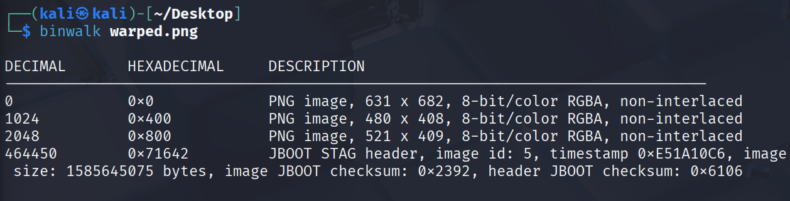
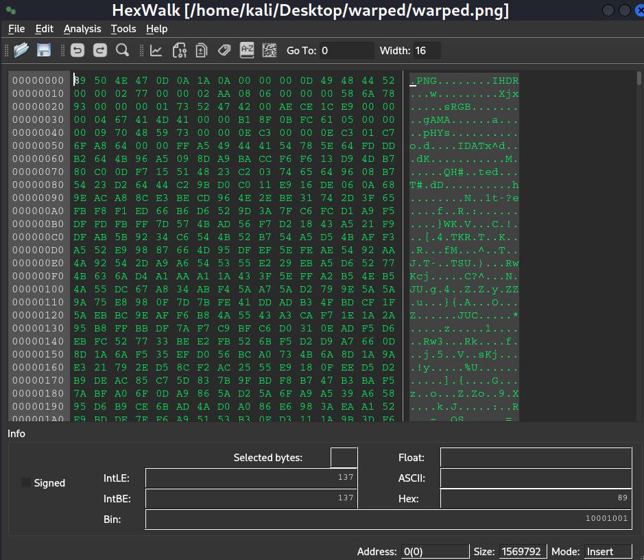
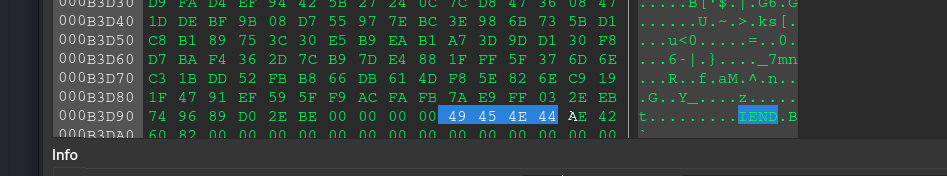

scrapbooking
======================

- **Category**: misc
- **Difficulty**: easy
- **Author**: Blue Alder

Rummaging through the ruins of an old server and next to some scissors and glue you find the remnants of what looks like a PNG file. 
**Handout files:**
- [./publish/warped.png](./publish/warped.png)
----
## Solve
- The provided file is warped.png, a corrupted PNG file? The file won't display in normal photo apps
- Looking into the file properties nothing really stands out until binwalk discovers 3 PNG images inside the file?

- The hint mentions scissors and glue and binwalk detects 3 PNG images 1024 bytes apart? 
- PNG files start with an 8 bytes signature `89 50 4E 47 0D 0A 1A 0A` and end with an `IEND` trailer, with `IDAT` image data in between, all contained within warped.png, binwalk is detecting just the first 1024 chunk which contains the header.




- Using Python to separate the 1024 chunks into 3 image files reveals the flag.
```python
chunk_size = 1024
new_images = [f"image_{i+1}.png" for i in range(3)]

with open("warped.png", "rb") as f:
	while True:
		for name in new_images:
			chunk = f.read(chunk_size)
			if not chunk:
				break
			with open(name, "ab") as out:
				out.write(chunk)
		else:
			continue
		break 
```
---


