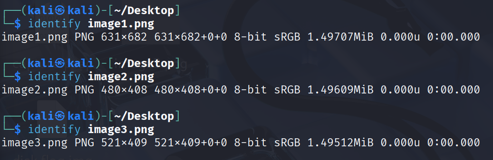

scrapbooking
======================

- **Category**: misc
- **Difficulty**: easy
- **Author**: Blue Alder

Rummaging through the ruins of an old server and next to some scissors and glue you find the remants of what looks like a PNG file. 
**Handout files:**
- [./publish/warped.png](./publish/warped.png)
----
## Solve
- The provided file is warped.png, a corrupted PNG file? The file wont display in normal photo apps
- Looking into the file properties nothing really stands out until binwalk discovers 3 PNG images inside the file?

- Using dd to extract the 3 images? 

- But these are only PNG headers, so there not actual images and they contain only enough data to display correct in cli tools but corrupt in image viewers, the hint mentions scissors and glue and these 3 headers are 1024 bytes in length.
- PNG files start with an 8 bytes signature `89 50 4E 47 0D 0A 1A 0A` and end with an `IEND` trailer, with `IDAT` image data in between, all contained within warped.png
![[Pasted image 20251103180538.png]]
![[Screenshot 2025-07-20 132623.png]]
![[Screenshot 2025-07-20 145920.png]]
- Using Python the PNG chunks can be separated and saved into 3 PNG's
```python
chunk_size = 1024
new_images = [f"image_{i+1}.png" for i in range(3)]

with open("warped.png", "rb") as f:
	while True:
		for name in new_images:
			chunk = f.read(chunk_size)
			if not chunk:
				break
			with open(name, "ab") as out:
				out.write(chunk)
		else:
			continue
		break 
```
- The recovered images containing the flag


